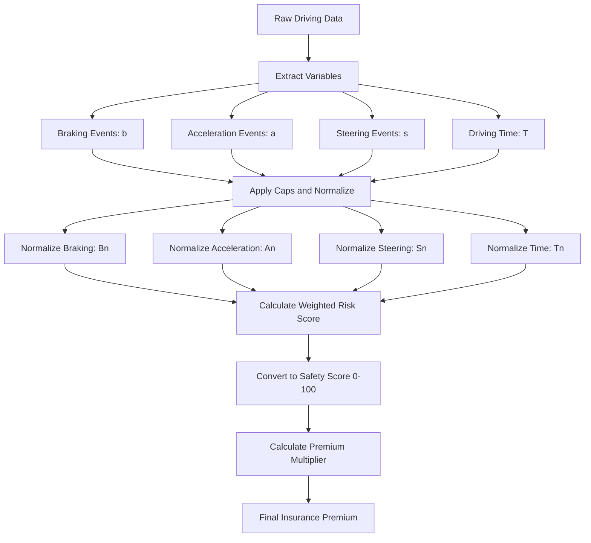

# Tesla Insurance Risk Model (Approximation)

This document outlines a simplified model to approximate how Tesla Insurance might calculate premiums based on driver behavior metrics.  
It is **not official**, only a research-based reconstruction using known factors such as harsh braking, acceleration, time driving, and steering speed.

---

## 1. Variables

- \( b \): harsh braking events per hour  
- \( a \): harsh acceleration events per hour  
- \( s \): steering aggressiveness (events/hour or deg/s)  
- \( T \): total driving time (hours)  

---

## 2. Baseline Risk Score

We assume risk grows with events and exposure time. Start with a weighted sum:

$$
R = w_b b + w_a a + w_s s + w_T T
$$

where:  

- \( w_b, w_a, w_s, w_T \) = weights for braking, acceleration, steering, and time respectively.

---

## 3. Normalize (0–1 Risk Fractions)

Use caps to avoid outliers dominating:

- b_cap = 4 events/hour  
- a_cap = 6 events/hour  
- s_cap = 8 events/hour (if event-based)  
- s_cap = 30 deg/s (if steering speed)  
- T_cap = 8 hours  

Formulas:

$$
B_n = \min\left(\frac{b}{b_{\text{cap}}}, 1\right)
$$

$$
A_n = \min\left(\frac{a}{a_{\text{cap}}}, 1\right)
$$

$$
S_n = \min\left(\frac{s}{s_{\text{cap}}}, 1\right)
$$

$$
T_n = \min\left(\frac{T}{T_{\text{cap}}}, 1\right)
$$

---

## 4. Weighted Risk Score

Combine normalized factors:

$$
R_n = w_b B_n + w_a A_n + w_s S_n + w_T T_n
$$

with example weights:

- \( w_b = 0.35 \)  
- \( w_a = 0.25 \)  
- \( w_s = 0.25 \)  
- \( w_T = 0.15 \)  

---

## 5. Map to Insurance Score (0–100)

Tesla uses a **safety score** scale. Convert risk to safety:

$$
\text{SafetyScore} = 100 \times (1 - R_n)
$$

---

## 6. Premium Multiplier

Insurance cost is scaled by score:

$$
\text{PremiumFactor} = 1 + k \left(1 - \frac{\text{SafetyScore}}{100}\right)
$$

where \( k \) controls sensitivity (e.g., \( k = 2 \) → up to 2× increase for poor drivers).

---

## 7. Example

Suppose:

- \( b = 2 \), \( a = 4 \), \( s = 10 \, \text{deg/s} \), \( T = 6 \, \text{hrs} \)  

Normalization:

$$
B_n = \frac{2}{4} = 0.5
$$

$$
A_n = \frac{4}{6} \approx 0.67
$$

$$
S_n = \frac{10}{30} \approx 0.33
$$

$$
T_n = \frac{6}{8} = 0.75
$$

Weighted risk:

$$
R_n = 0.35(0.5) + 0.25(0.67) + 0.25(0.33) + 0.15(0.75) \approx 0.54
$$

Safety score:

$$
\text{SafetyScore} = 100 \times (1 - 0.54) = 46
$$

Premium multiplier (with \( k = 2 \)):

$$
\text{PremiumFactor} = 1 + 2(1 - 0.46) \approx 2.1
$$

So the premium is **~2.1× the baseline**.

---

## 8. Flow Diagram

